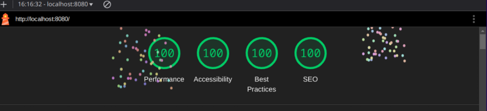
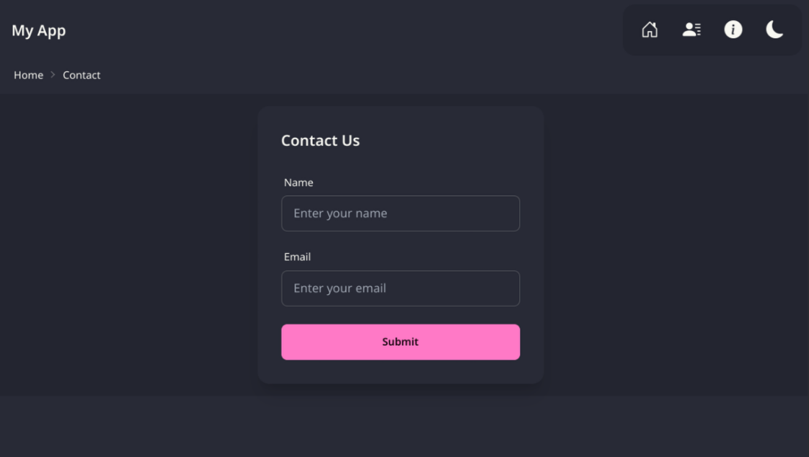
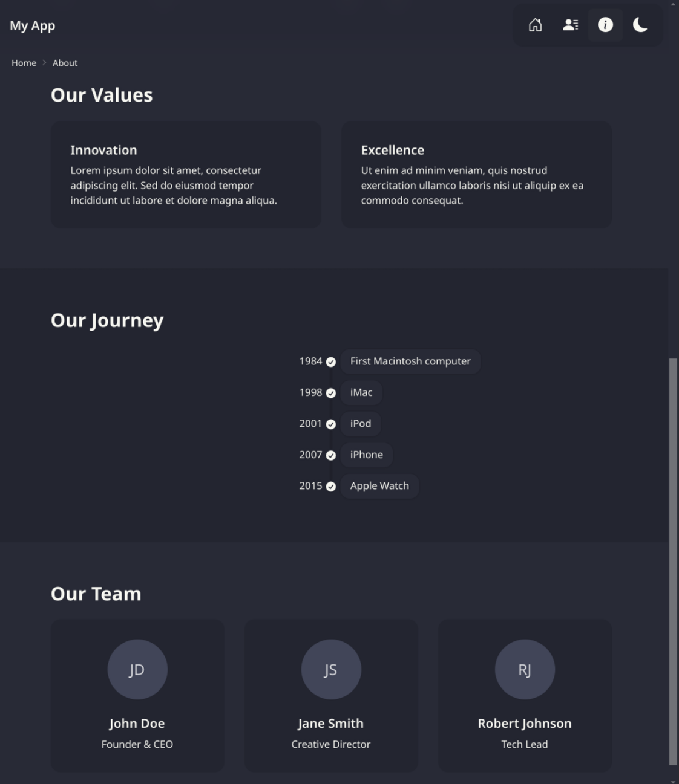
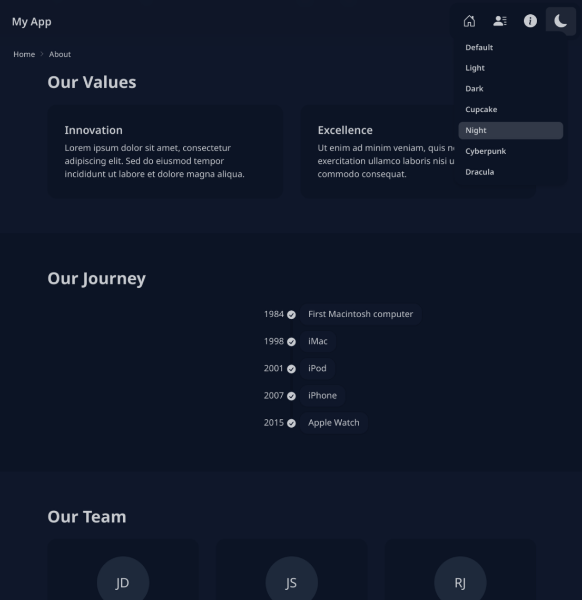

# A Template for Lit + Tailwind + Daisy + Bun

A starter template for a web app built with

<a href="https://lit.dev/" style="padding: 12px;"> Lit</a>
<a href="https://tailwindcss.com/" style="padding: 12px;"> Tailwind</a>
<a href="https://daisyui.com/" style="padding: 12px;"> Daisy UI</a>
<a href="https://bun.sh/" style="padding: 12px;"> Bun</a>

## Contents

- [Using this Repo](#using-this-repo)
- [Running the App](#running-the-app)
- [Building a Distribution](#building-a-distribution)
- [Running the Distribution Locally](#running-the-distribution-locally)
- [Features](#features)
- [Screenshots](#screenshots)
- [How it Works](#how-it-works)

## Using this Repo

```bash
bun create github.com/dazraf/lit-tailwind-daisy-bun <your-directory-name>
cd <your-directory-name>
```

## Running the App

```bash
bun dev
```

## Building a Distribution

Useful for testing as well as running the Lighthouse report.

```bash
bun run build
```

## Running the Distribution Locally

```bash
npx http-server dist -p 5173 -g --proxy http://localhost:5173\?
```

## Features

- Nav Toolbar
- [Theme Selector](./src/components/ThemeSelector.ts)
- Routing for three pages using the [Lit Router](https://www.npmjs.com/package/@lit-labs/router): [`/`](./src/components/pages/HomePage.ts), [`/contact`](./src/components/pages/ContactPage.ts) and [`/about`](./src/components/pages/AboutPage.ts).
- Mixin class [`AppStyledElement.ts`](./src/components/AppStyledElement.ts) which gives you all the power of Tailwind and Daisy for Lit components
- [Bootstrap icons](https://icons.getbootstrap.com/) wrapped as a [web component](./src/components/Icon.ts)
- [Breadcrumbs](./src/components/Breadcrumbs.ts)
- 100% Lighthouse Score



## Screenshots







## How it Works

### Vite Setup

The [vite app](./vite.config.mts) was created with `bun create vite my-vue-app --template lit-ts`. Then I added `vite-plugin-compression` and `vite-plugin-sitemap` to meet best practices as recommended by [Lighthouse](https://developer.chrome.com/docs/lighthouse/overview/).

### Packages

The app uses [the packages](./package.json) for Tailwind (including `@tailwind/typography` `postcss` and `autoprefixer`), Daisy, Lit Router, Bootstrap Icons and the URLPatter polyfill.

### Tailwind Configuration

I've [configured Tailwind](./tailwind.config.js) to include Tailwind's typography package and Daisy UI. As the app demonstrates the use of Daisy's multiple themes, I've also configured the selected list in the config. Unfortunatley, this list has to be replicated in the app itself in [`ThemeSelector.ts`](./src/components/ThemeSelector.ts).

### How Tailwind is used in the App

Tailwind is included in the application's [`index.css`](./src/index.css). The build system will use Tailwind to generate a minimal set of CSS definitions as used by the app. The app includes this file in [`AppStyledElement.ts`](./src/components/AppStyledElement.ts)

```typescript
import inlineCss from "../index.css?inline";
export const appStyle = unsafeCSS(inlineCss);
```

This will ensure that we only load the CSS file once to be used by Lit elements. Typically the compiler will error when importing a CSS file and when using the `?inline` parameter, but this is easily dealt with [`global.d.ts`](./src/global.d.ts):

```typescript
declare module "*.css";
declare module "*.css?inline";
```

The [`AppStyledElement`](./src/components/AppStyledElement.ts) mixin is then used when creating a new Lit component e.g.

```typescript
@customElement("app-breadcrumbs")
export class Breadcrumbs extends AppStyledElement(LitElement) {
  //...
}
```

### Navigation and the Lit Router

The Lit Router is a great lightweight library. In [`navigation.ts`](./src/navigation.ts) I've hooked the browser's [`globalThis.history.pushState`](https://developer.mozilla.org/en-US/docs/Web/API/History/pushState) to keep it updated.

### Theme Selection

I've decided to use Daisy's [Theme Controller](https://daisyui.com/components/theme-controller/), wrapping it in a Lit component and altering some of the UX behaviour. I think this one could do with more work to allow for full accesibility via only the keyboard.

<hr>
